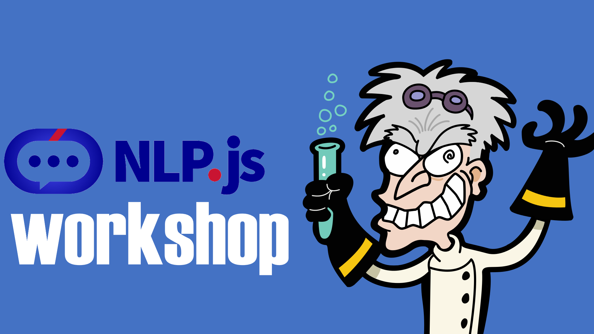

# NLP.js workshop



You must have node.js installed, I recommend version 14 or newer.
Remember to create a folder for the workshop and run:
```shell
  npm init
```

## TABLE OF CONTENTS

<!--ts-->

- [Introduction](doc/01-introduction.md)
- [Tokenization](doc/02-tokenization.md)
- [Classification](doc/03-classification.md)
- [Confusion Matrix](doc/04-confusion-matrix.md)
- [Stemming](doc/05-stemming.md)
- [NLU](doc/06-nlu.md)
- [NER](doc/07-ner.md)
- [NLG](doc/08-nlg.md)
- [NLP](doc/09-nlp.md)
  - [Basic Usage](doc/09-nlp.md)
  - [Console Connector](doc/10-console-connector.md)
  - [Directline Connector](doc/11-console-connector.md)
<!--te-->
