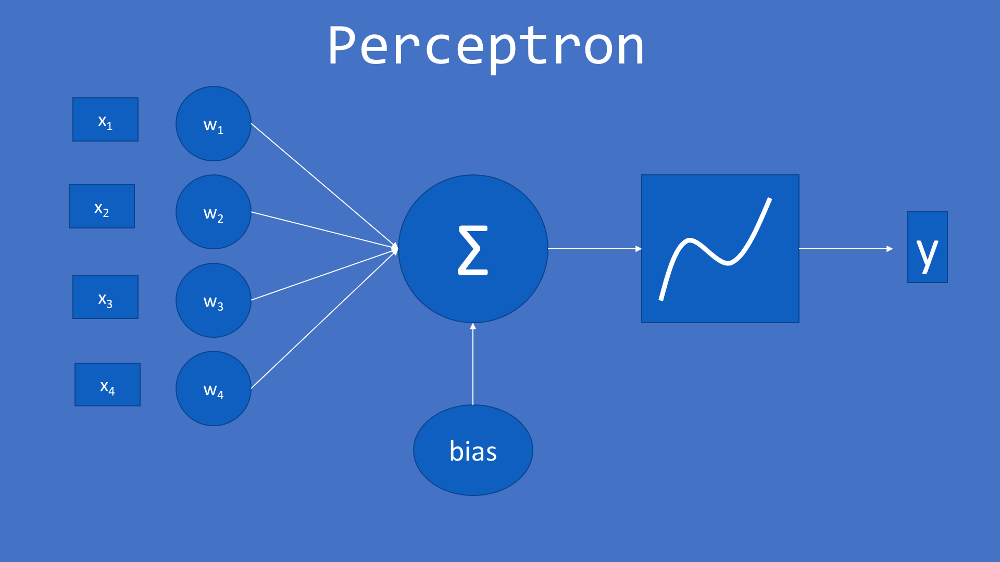
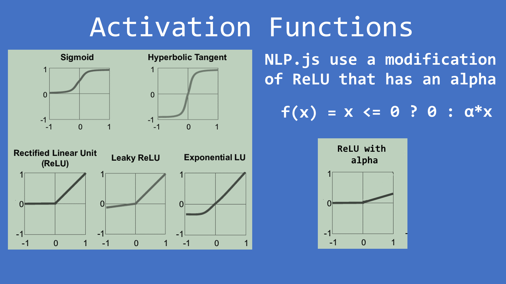
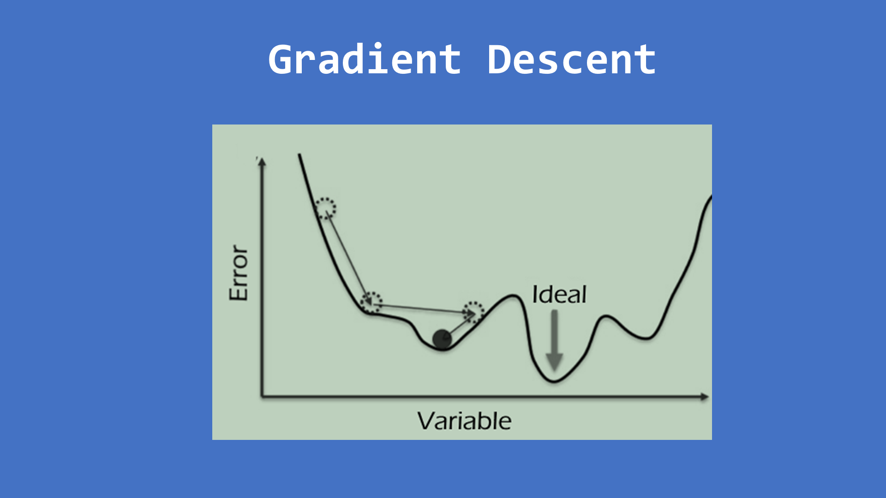

# Classification





## Install libraries

First at all install libraries. From the tokenization, you already have _@nlpjs/lang-en_ installed, but you have to install two libraries more: _@nlpjs/neural_ to have the neural network, and _@nlpjs/utils_ to have the _CorpusLookup_ that is the class to manage your corpus and transform to the format of the neural network.

```shell
  npm i @nlpjs/neural @nlpjs/utils
```

## Require classes

Now you have to require _TokenizerEn_, _NeuralNetwork_ and _CorpusLookup_ from their libraries:

```javascript
const { TokenizerEn } = require('@nlpjs/lang-en');
const { NeuralNetwork } = require('@nlpjs/neural');
const { CorpusLookup } = require('@nlpjs/utils');
```

## Require corpus

Take a look into the file _corpus-en.json_ located at the _data_ folder. It contains the corpus that we will use for benchmarking. It contains 50 intents, each intent contains 5 sentences to train and 5 to test. Also, an intent None exists, with 6 sentences that represents those that should not be classified into any of the existing intents.

```javascript
const corpus = require('../../data/corpus-en.json');
```

## Train function

First at all we need a function to tokenize a sentence:

```javascript
const tokenizer = new TokenizerEn();
const tokenize = x => tokenizer.tokenize(x, true);
```

Then we need a function that receives a corpus, and return all the needed for classification. To do that:
- Create a NeuralNetwork
- Create the lookups: dictionaries to transform the corpus into the format that the neural network uses, and that we will use to transform any input utterance into the format of the neural network, and also to transform the output of the neural network into the intents.
- Train the neural network
- Return the neural network and the lookups

```javascript
function train(corpus) {
  const net = new NeuralNetwork({ log: true });
  const lookups = new CorpusLookup(corpus, { tokenizeAndStem }, false);
  net.train(lookups.trainData);
  return { net, lookups };  
}
```

## Process function

We need a function that given a sentence and the output from the train function (neural network and lookups), return the classifications.

```javascript
function process(utterance, input) {
  const formatted = input.lookups.prepareInput(utterance);
  const output = input.net.run(formatted);
  return { classifications: input.lookups.objToClassifications(output) };
}
```

## Measure all tests

The corpus contains intents, and each intent contains tests, so we need a loop to iterate the intents and then another one to iterate the tests. We classify each test and compare the result from the neural network with the expected intent, to calculate the precision.

```javascript
const net = train(corpus);
let total = 0;
let good = 0;
corpus.data.forEach(item => {
  item.tests.forEach(test => {
    total += 1;
    const { classifications } = process(test, net);
    if (classifications[0].intent === item.intent) {
      good += 1;
    }
  });
});
console.log(`${good} good of a total of ${total} (${good*100/total}%)`);
```

## Benchmark

