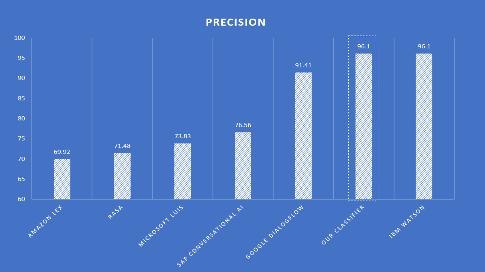

# Stemming


Import _StemmerEn_ instead of _TokenizerEn_, and remove it's usage. Then replace how to create the _CorpusLookup

```javascript
  const lookups = new CorpusLookup(corpus, new StemmerEn(), false);
```

## Benchmark

