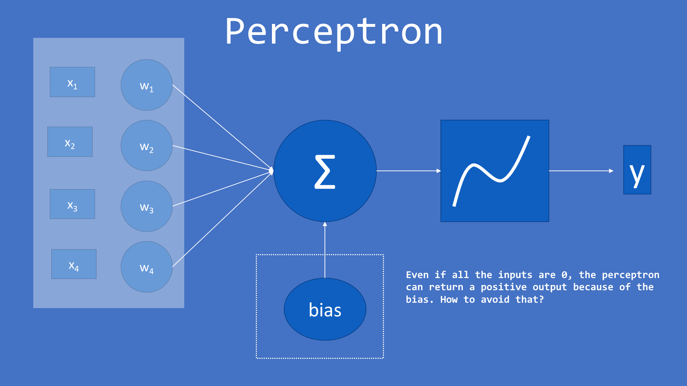
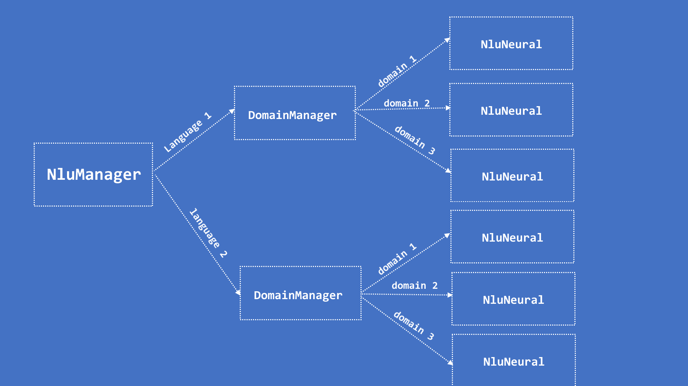

# NLU



To avoid that we can implement a way to put 0 as result of every perceptron that has none positive input activated. To do that, for each perceptron, we kept a dictionary of the features that belongs to utterances of the training with output 1 for this perceptron. When a sentence enters to be processed, we look his features, and set 0 to the output of perceptrons that has none positive feature in common with the sentence.

Also, we add a mechanism so unknown features has a little weight into None feature.

This is done by the class _NluNeural_ that is an upper abstraction over the _NeuralNetwork_ class.

## Installation

First at all you'll need to install the library _@nlpjs/nlu_ that contains several classes for NLU.

```bash
  npm i @nlpjs/nlu
```

## Usage

Replace the requires with those ones:

```javascript
const { containerBootstrap } = require('@nlpjs/core');
const { LangEn } = require('@nlpjs/lang-en');
const { NluNeural } = require('@nlpjs/nlu');
const { NlpAnalyzer } = require('@nlpjs/utils');
```

Now the train function is like this:

```javascript
async function train(corpus) {
  const preparedCorpus = corpus.data.reduce((prev, current) => {
    prev.push(...(current.utterances.map(x => ({ utterance: x, intent: current.intent }))));
    return prev;
  }, []);
  const container = containerBootstrap();
  container.use(LangEn);
  const net = new NluNeural({ locale: 'en', container });
  await net.train(preparedCorpus);
  return net;
}
```

The first part, the _preparedCorpus_, is converting the corpus to the format of an array of _{ utterance, intent }_
The **const container = containerBootstrap();** is creating a new IoC container.
The **container.use(LangEn);** is adding the _LangEn_ class to the container, so it will register the normalizer, tokenizer, stemmer, trigrams and sentiment analyisis so they will be available in the container and all the instances that use this contaier.
Then we create the _NluNeural_ instance, and we tell this instance to use the container and that the locale of the language is _en_ for english. 

The process function now will be like this:

```javascript
const process = (utterance, input) => input.process(utterance);
```

## Benchmark


## NLU Structure

