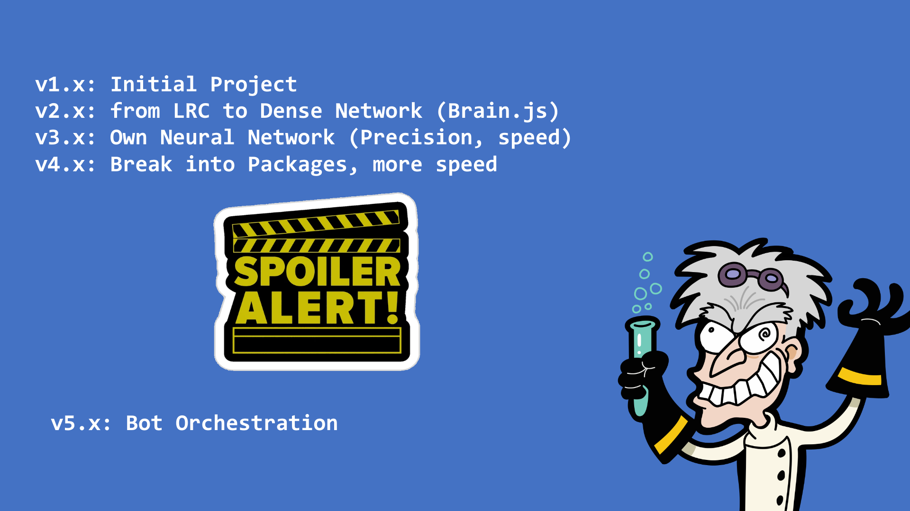

# Bots



## Installation

Add _@nlpjs/bot_ package

```shell
  npm i @nlpjs/bot
```

## Corpus in new format

```
language en
contextdata ./heros.json
intent joke
  utterances
  - Tell me a chuck norris joke
  - Joke about Chuck norris
  - Chuck Norris fact
intent hero.realname
  utterances
  - What is the real name of @hero?
  answers
  - The real name of {{ hero }} is {{ _data[entities.hero.option].realName }}
intent hero.city
  utterances
  - Where @hero lives?
  - What's the city of @hero?
  answers
  - {{ hero }} lives at {{ _data[entities.hero.option].city }}
entity hero
  - spiderman: spiderman, spider-man
  - ironman: ironman, iron-man
  - thor: thor
```

## Create script.dlg

```
# Script for a simple turn conversation
import corpus-ner.dlg
dialog main
  nlp
```

## Change conf.json

```json
{
  "settings": {
    "nlp":{},
    "api-server": {
      "port": 3000,
      "serveBot": true
    },
    "bot": {
      "scripts": ["./script.dlg"]
    }
  },
  "use": ["Basic", "LangEn", "ConsoleConnector", "ExpressApiServer", "DirectlineConnector", "Bot"]
}
```

## Index.js

```javascript
const { dockStart } = require('@nlpjs/basic');
const { request } = require('@nlpjs/request');

(async () => {
  const dock = await dockStart();
  const nlp = dock.get('nlp');
  nlp.onIntent = async (nlp, input) => {
    if (input.intent === 'joke') {
      const apiAnswer = await request('http://api.icndb.com/jokes/random');
      input.answer = apiAnswer.value.joke;
    }
  };
})();
```